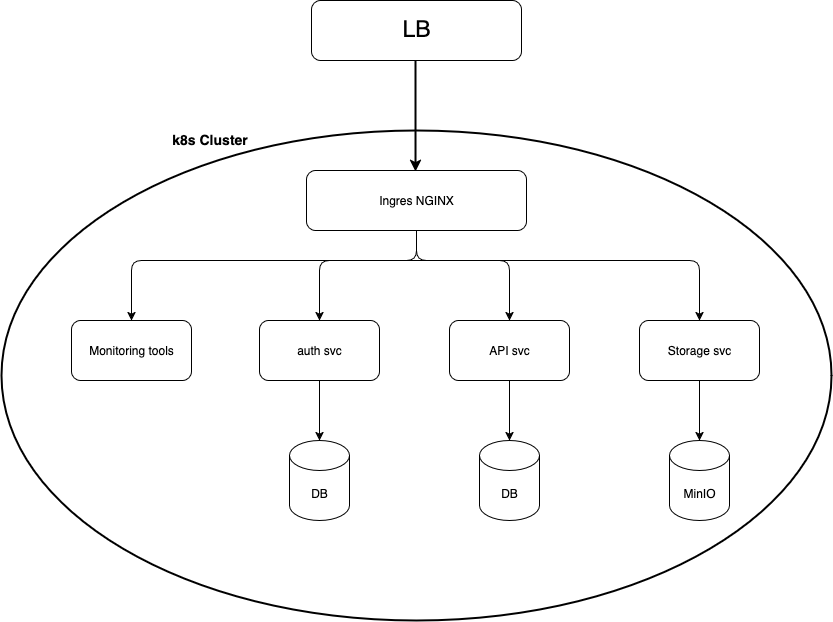

# SRE Kubernetes Assignment

## 📋 Overview
This project demonstrates a practical SRE setup of a reliable, secure, observable, and scalable microservices system using Kubernetes. It includes three web services written in different languages:
- **Auth Service** (Node.js)
- **API Service** (Go)
- **Image Storage Service** (Python)

The system also features PostgreSQL databases, MinIO for storage, and monitoring tools such as Prometheus, Grafana, and Alertmanager.

---

## 🏠 System Architecture

### Architecture Diagram


### Service Interactions
- **Auth Service**: Handles login, registration, and token verification
- **API Service**: Main gateway for business logic and data access
- **Image Storage Service**: Handles image upload and retrieval
- **PostgreSQL**: Dedicated database for each service
- **MinIO**: Stores uploaded image files

### Isolation & Security
- **Namespaces**: Each service is deployed in its own namespace (`auth`, `api`, `image-storage`)
- **Network Policies**: Restricts inter-pod communication
- **Secrets Management**: Manages credentials (JWT, DB passwords) using Kubernetes Secrets

---

## 🚀 Quick Start

### Requirements
- Docker
- Kubernetes (Kind or Minikube)
- kubectl

### Deployment Steps
```bash
kubectl apply -f k8s/namespaces/
kubectl apply -f k8s/infrastructure/
kubectl apply -f k8s/secrets/
kubectl apply -f k8s/deployments/
kubectl apply -f k8s/services/
kubectl apply -f k8s/network-policies/
kubectl apply -f k8s/ingress/
kubectl apply -f k8s/monitoring/
kubectl apply -f k8s/autoscaling/
```

---

## 📊 Monitoring & Dashboards

### Tools Used
- **Prometheus**: Collects metrics
- **Grafana**: Visualizes metrics and dashboards
- **Alertmanager**: Sends alerts

### Dashboards (Images Attached)
- Auth Service
- API Service
- Image Storage
- Cluster Resources
- System Overview

### Alert Integrations
- Mailgun
- Slack
- PagerDuty

---

## 🎥 Failure Recovery

### Demo Video
[Failure Recovery.mov](Failure%20Recovery.mov)

### Covered Scenarios
1. Database crash and recovery
2. Service crash and Kubernetes rescheduling
3. High traffic auto-scaling with HPA
4. Node failure and pod rescheduling
5. Resource exhaustion (CPU stress test)
6. Network policy enforcement test
7. Alert monitoring validation

---

## 📁 Project Structure
```
sre-k8s-assignment/
├── services/               # Code for all services
├── k8s/                   # Kubernetes YAML files
├── docs/                  # Architecture and setup documentation
├── scripts/               # Automation and test scripts
├── *.png/*.mov            # Images and video
└── README.md
```

---

## 🔧 Technical Implementation Checklist
- [x] Architecture diagram and interaction flow
- [x] Dockerfiles and private registry setup
- [x] Kubernetes manifests for all components
- [x] Network Policies, TLS, and Secrets
- [x] HPA, health probes, and PodDisruptionBudget
- [x] Monitoring stack, dashboards, and alerting
- [x] Failure simulation with documented video
- [x] Comprehensive README and documentation

---

## 📚 Documentation
- [Architecture Overview](architecture-diagram.txt)
- [Monitoring & Alerts](System Overview Dashboard.png)

---

## 🧪 Testing
```bash
./scripts/generate-traffic.sh
./scripts/simulate-failures.sh
./scripts/test-alerts.sh
```

---

## 📈 Performance
- CPU Utilization: HPA triggers at 70%
- Memory Limits: 512Mi to 1Gi
- Replica Range: 2 to 10 per service

---

## 🔒 Security
- Network Policies to control traffic
- Namespace isolation for services
- Kubernetes Secrets for sensitive data
- TLS encryption via Ingress

---

## 🎯 Lessons Learned
- Kubernetes simplifies HA, scaling, and recovery with proper configurations
- Observability is essential in production-grade systems
- Isolated and well-documented services improve maintainability

---

## 👥 About
- Created by: **Abdulaziz Alrouji**
- GitHub: [abdulaziz107/sre-k8s-assignment](https://github.com/abdulaziz107/sre-k8s-assignment)

